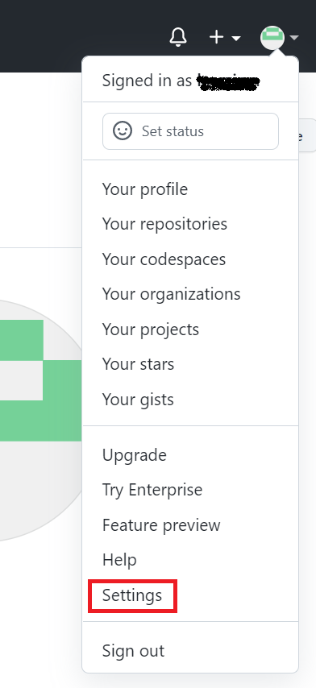
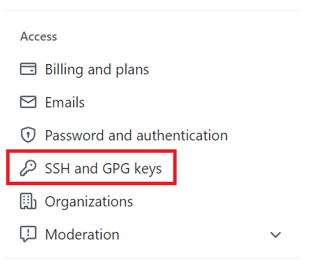
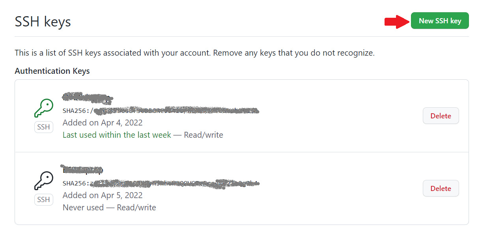
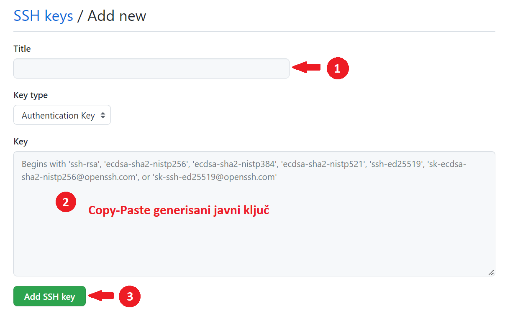
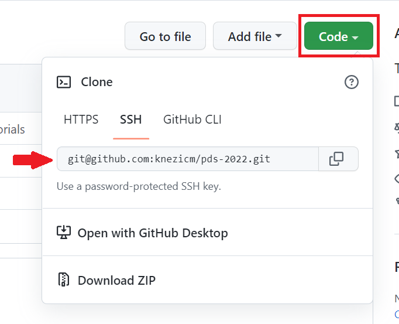

## Instalacija Git alata

Prije nego što možete početi sa radom, potrebno je da instalirate Git alat.

Instalacija na *Windows* platformi se svodi na preuzimanje odgovarajućeg [instalacionog fajla](https://git-scm.com/download/win) (podržana je 32-bitna i 64-bitna arhitektura) i njegovo izvršavanje. Postupak instalacije je sličan instalaciji bio kojeg programa u *Windows* okruženju. Nakon instalacije, korisnik može da pokrene *Git Bash* konzolu u bilo kojem folderu tako što će unutar željenog foldera da izabere desni klik a zatim opciju *Git Bash Here* u padajućem meniju. Unutar konzole koja se otvori, mogu da se unose Git komande koje ćemo kasnije pominjati.

**Napomena:** Alternativno, Git alat se može koristiti i iz komandne linije (*Windows Command Prompt*) ukoliko ste instalacioni folder Git alata dodali kao varijablu okruženja (*Environment Variable*).

U okviru *Linux* okruženja, postupak instalacije zavisi od *Linux* distribucije koju koristite, kao što je opisano u [instrukcijama](https://git-scm.com/download/linux). Na primjer, u slučaju *Ubuntu* distribucije, dovoljno je pokrenuti sljedeću komandu u konzoli:

```
sudo apt-get install git
```

Postoji velika vjerovatnoća da je Git alat već instaliran na *Linux* platformi, pa se preporučuje da to prvo provjerite prije instalacije sljedećom komandi u konzoli:

```
git --version
```

## Generisanje ličnog SSH ključa za pristup repozitorijumu

Prvi korak za ostvarenje pristupa GitHub repozitorijumu je generisanje jedinstvenog SSH ključa. U tom smislu je potrebno u okviru *Linux* ili *Windows Prompt* konzole (uz pretpostavku da je instaliran SSH klijent), odnosno alternativno u okviru *Git Bash* konzole ako je instaliran Git, unijeti sljedeću komandu:

```
ssh-keygen -t rsa -b 2048
```

Pojaviće se sljedeće pitanje:

```
Generating public/private rsa key pair.
Enter file in which to save the key (/home/<user>/.ssh/id_rsa):
```

U slučaju *Windows Prompt* konzole, podrazumijevana putanja u kojoj će da se sačuva par ključeva (javni i privatni), koja je navedena u zagradi, razlikovaće se i imaće oblik `C:\Users\<user>/.ssh/id_rsa`. U oba slučaja, `<user>` će odgovarati korisničkom imenu. Naravno, ako želite da ključ sačuvate na nekoj drugoj lokaciji, potrebno je da definišete njenu putanju zajedno sa nazivom samog fajla (preporuka je da koristite ponuđeni naziv fajla).

Nakon što definišete lokaciju i naziv fajla (odnosno zadržite podrazumijevanu opciju pritiskanjem tastera *Enter*), prikazaće se sljedeća poruka:

```
Enter passphrase (empty for no passphrase):
Enter same passphrase again:
```

Ukoliko želite da pristup dodatno zaštitite šifrom (nije obavezno), potrebno je da je definišete u ovom koraku. Važno je napomenuti da trebate zapamtiti ovu šifru, inače nećete moći da pristupite repozitorijumu preko SSH sa generisanim ključem. Ukoliko ne želite da definišete šifru za ovaj ključ, potrebno je samo da pritisnete taster *Enter*.

Generisane ključeve možete da preuzmete na lokaciji koju ste prethodno definisali. Alat `ssh-keygen` će generisati dva fajla: `id_rsa` (privatni ključ) i `id_rsa.pub` (javni ključ), uz pretpostavku da ste zadržali ponuđeno ime fajla, tj. `id_rsa`. Privatni ključ trebate da lokalno čuvate u folderu SSH klijenta (`/home/<user>/.ssh/` u *Linux*, odnosno `C:\Users\<user>/.ssh/` u *Windows* okruženju). Konačno, javni ključ trebate dostaviti na GitHub u okviru podešavanja svog korisničkog naloga.

## Prenos javnog SSH ključa na GitHub platformu

Da biste prenijeli javni ključ, koji zapravo predstavlja tekstualni sadržaj fajla `id_rsa.pub`, potrebno je da se ulogujete na GitHub sa prethodno kreiranim korisničkim nalogom i da odaberete opciju *Settings* u meniju korisničkog naloga (gornji desni ugao na mjestu korisničkog avatara, kao što je prikazano na slici ispod).



Nakon što ste odabrali ovu opciju, pojaviće se stranica sa korisničkim podešavanjima. U meniju sa lijeve strane, potrebno je odabrati opciju *SSH and GPG Keys* označenu na slici ispod.



Pojaviće se prozor sa podešavanjima vezanim za SSH ključeve u kojem se prikazuju već dodani ključevi. Za dodavanje novog ključa, trebate kliknuti na dugme *New SSH key* označeno na slici.



Pojaviće se novi prozor za unos novog ključa sa poljima prikazanim na slici ispod. Prvo treba definisati ime ključa (polje *Title*). Polje *Key type* treba zadržati kao na slici (*Authentication Key*). U polje *Key* treba unijeti javni ključ generisan kako je opisano iznad. U tom smislu, potrebno je da otvorite prethodno generisani javni ključ (fajl `id_rsa.pub`) u nekom tekstualnom editoru (npr. *Notepad* u *Windows* okruženju), a zatim da kopirate kompletan sadržaj ovog fajla i prilijepite tako kopiran sadržaj u polje *Key*. Konačno, da sačuvate ključ, kliknite na dugme *Add SSH key*.



Ovim je proces podešavanja SSH veze u GitHub okruženju kompletirano. Ostaje da pristupite kloniranju repozitorijuma i korišćenju ostalih opcija koje nudi Git alat. Za više informacija o korišćenju Git alata, možete da pogledate skup video materijala koje možete pronaći na sljedećem [YouTube kanalu](https://www.youtube.com/watch?v=qZ41BiMd1yI&list=PLwgfxpYcBNqGyUdy37jpFxAt-DdeSAHbU).

## Inicijalno podešavanje Git alata i kloniranje repozitorijuma

Da biste inicijalno mogli da koristite Git alat za pristupite repozitorijumu, potrebno je da klonirate repozitorijum. Međutim, prije kloniranja, morate postaviti podešavanja za alat. Minimalno, zahtjeva se podešavanje imena korisnika i email adrese. U tu svrhu, unutar *Git Bash* konzole koristimo sljedeće komande:

```
git config --global user.name "Ime Prezime"
git config -- global user.email "ime.prezime@student.etf.unibl.org"
```

pri čemu trebate `Ime Prezime` i `ime.prezime` zamijeniti stvarnim podacima.

Sada možemo da koristimo Git alat, a prva komanda je svakako kloniranje repozitorijuma. Koristimo SSH pristup na način da kopiramo link za SSH pristup koji se dobija klikom na dugme *Code* u okviru repozitorijuma, kao što je ilustrovano na slici.



Ovaj link zatim proslijedimo komandi `git clone` na sljedeći način:

```
git clone git@github.com:knezicm/pds-2022.git
```

**Napomena:** Git će automatski da napravi folder sa nazivom repozitorijuma (u datom slučaju `pds-2022`) u okviru foldera iz kojeg pokrećemo komandu. Za sve naredne Git komande, moramo da se nalazimo u validnom Git repozitorijumu, tj. da se prebacimo u folder kreiran `git clone` komandom.
