## Životni vijek zadatka u GitHub okruženju

Svaki zadatak u GitHub okruženju (tipično se zove *Issue*) obično kreira osoba koja je odgovorna za njegovu realizaciju. Zadatak kreiramo u okviru projekta pridruženog repozitorijumu odabirom opcije *Add item* na virtuelnoj ploči projekta kao što je ilustrovano na slici ispod.

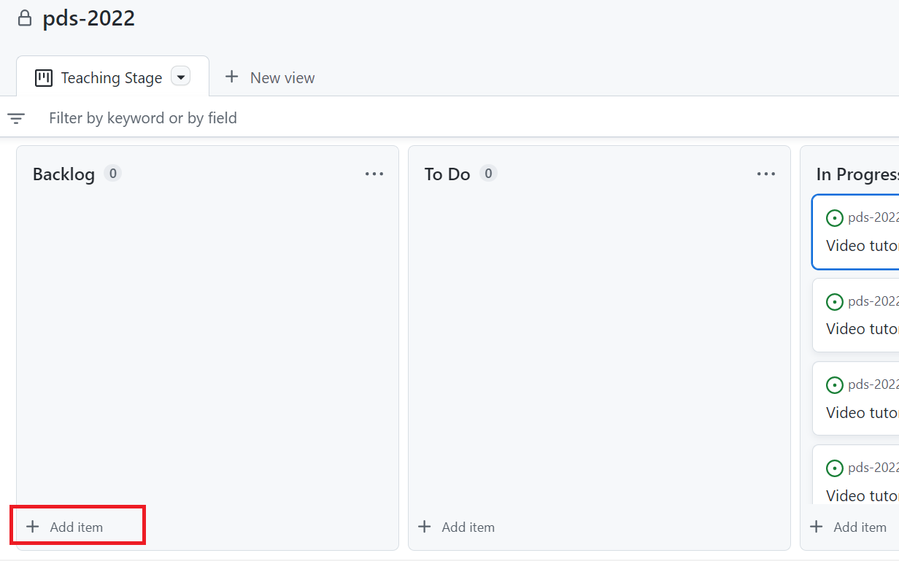

Prvi korak je definisanje imena zadatka unutar polja koje će da se pojavi, kao što je ilustrovano na sljedećoj slici.

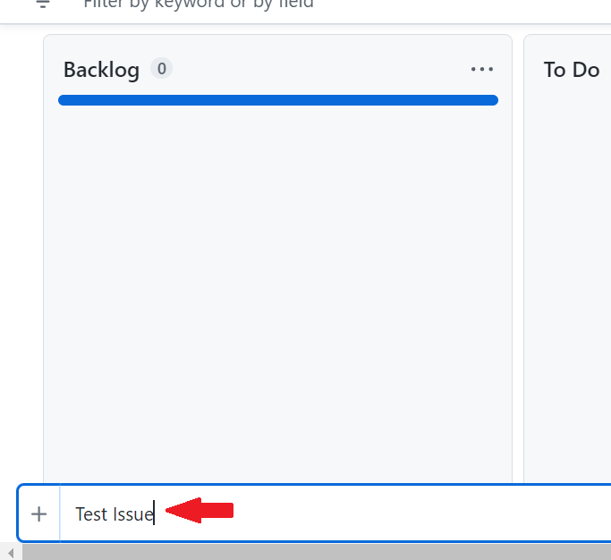

Zadatak će da se pojavi u odabranoj koloni (u datom primjeru *Backlog*) sa tzv. *draft* statusom kao na slici.

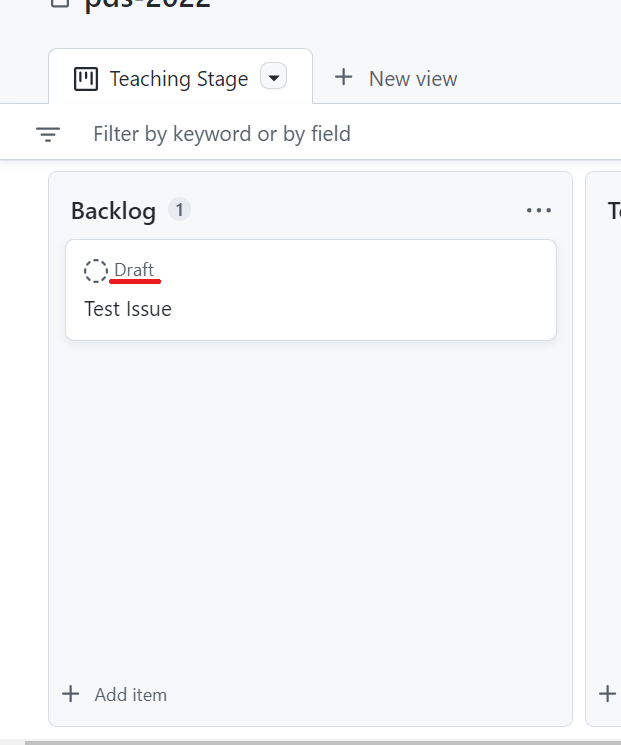

Za ovako kreiran zadatak možemo da mijenjamo parametre tako što ćemo da kliknemo na ime zadatka, čime otvaramo prozor sa opisom i drugim opcijama. Da bismo detaljnije opisali šta je svrha zadatka, prvo ćemo definisati njegov opis klikom na dugme *Edit* prikazano na sljedećoj slici.

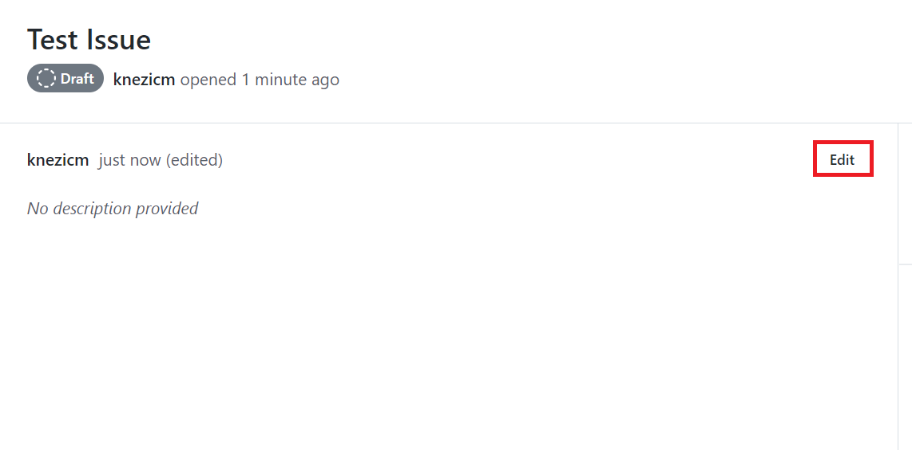

Opis unosimo u polje za komentar kao što je prikazano na slici ispod, a zatim potvrđujemo unos klikom na dugme *Update comment*.

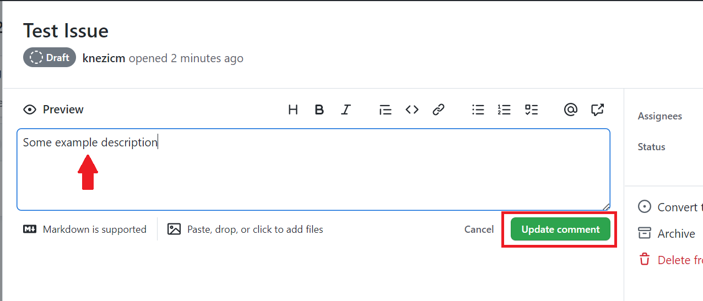

Nakon toga, krajnje desno u prozoru zadatka, zadatak dodjeljujemo jednom ili više korisnika koji će raditi na njegovoj realizaciji (opcija *Add assignees...*) i konvertujemo ovako definisan zadatak u *issue* kako bi on bio vidljiv u repozitorijumu (opcija *Convert to issue*)

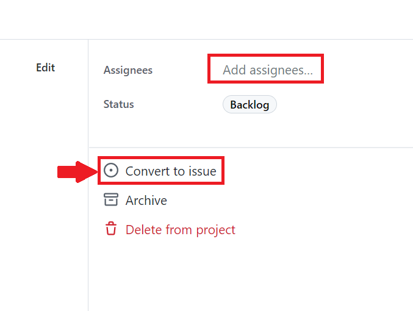

Prilikom konverzije, potrebno je odabrati repozitorijum kojem zadatak pripada.

Nakon konverzije, pojaviće se dodatne opcije kojima bolje možemo opisati zadatak. Radi lakšeg praćenja, zadaci se označavaju labelama koje određuju njegov karakter (opcija *Add labels...*). Tipično se koristi labela *task*, ali se mogu dodati i druge po potrebi. Osim labele, svakom zadatku treba da bude pridružen odgovarajući *Milestone* projekta (opcija *Add milestone...*). Konačno, korisnik može da definiše i druge parametre koji se prikazuju klikom na opciju *Show all fields*.

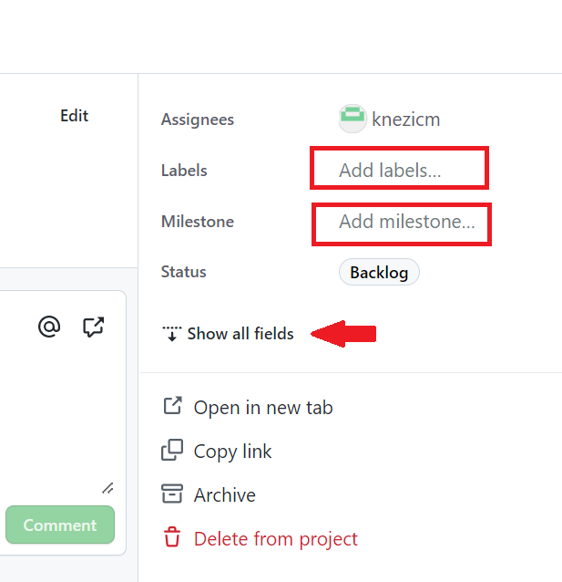

U datom primjeru, definisani parametri zadatka imaju izgled kao na slici ispod, ali se u konkretnom slučaju trebaju prilagoditi.

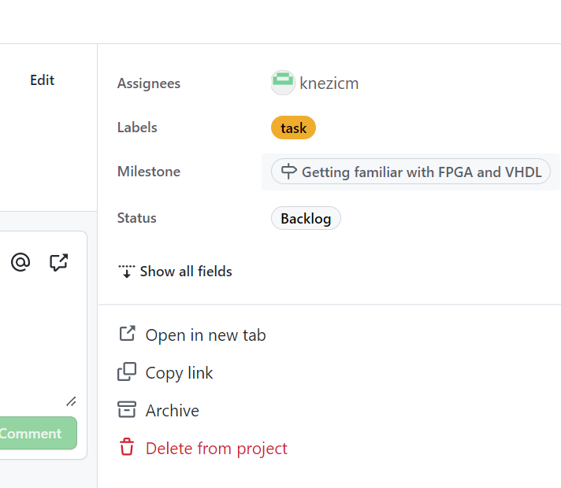

Zadaci na kojima se radi tokom sedmice prebacuju se iz *Backlog* u  *To Do* sekciju. Kada se počne sa realizacijom konkretnog zadatka, on se prebacuje iz *To Do* u *In Progress* sekciju, nakon čega se kreira zaseban ogranak (*branch*) zadatka i tzv. *Pull Request*. Ovo se može postići lokalno iz Git okruženja, ali se to najčešće radi u samom GitHub okruženju.

Po završetku izrade zadatka, zadaci se prebacuju u *Review* sekciju na pregled od strane drugih članova tima i/ili predmetnog nastavnika. Nakon pregledanja, nastavnik ili članovi tima odobravaju integraciju rješenja zadatka (*merge*), tj. njegove grane, u glavnu granu projekta od koje je ogranak zadatka nastao. Tada se zadatak premješta u sekciju *Done*, nakon čega može da se zatvori klikom na dugme *Close* kao što je prikazano na sljedećoj slici.

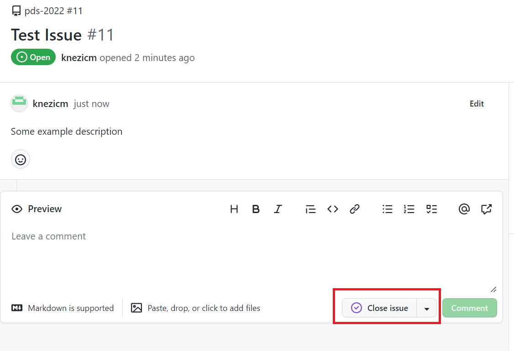

### Kreiranje novog ogranka i *Pull Request* zahtijeva na GitHub platformi

Nakon što smo kreirali zadatak, kada počnemo da ga rješavamo, prvo trebamo da napravimo zaseban ogranak tog zadatka. To možemo učiniti tako što odemo u listu zadataka unutar repozitorijuma (tabulator *Issues*) i otvorimo željeni zadatak. Krajnje desno u prozoru, unutar sekcije *Development*, kliknemo na link *Create a branch* označen na slici ispod.

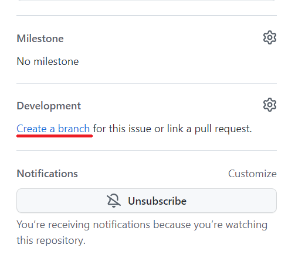

Alternativno, možemo da povežemo postojeći *Pull Request* (ako smo ga kreirali iz već postojeće grane) tako što kliknemo na ikonu sa podešavanjima (vidi sliku ispod), a zatim odaberemo repozitorijum i postojeću granu, odnosno *Pull Request* iz prikazane liste.

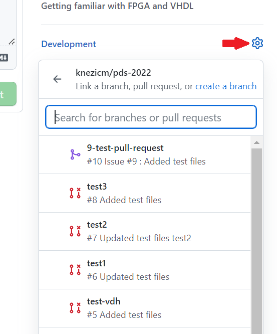

Ako smo odlučili da kreiramo ogranak unutar GitHub okruženja kako je opisano iznad, pojaviće se prozor u kojem je potrebno odabrati granu iz koje će da se izvede naša grana (klikom na link *Change branch source* kako je prikazano na slici ispod). To je obično glavna grana projekta (u našem slučaju se zove *assignments*).

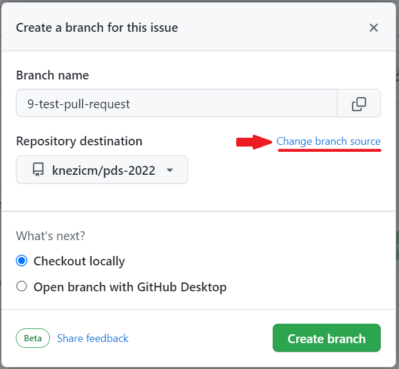

U okviru polja *Branch source* odaberemo željenu granu (u našem slučaju *assignments*) i kliknemo da dugme *Create branch* kao što je pokazano na sljedećoj slici. Takođe, ukoliko želimo, možemo da promijenimo naziv grane u polju *Branch name*. Podrazumijevano, grana će imati naziv koji počinje brojem zadatka i riječima njegovog naziva (preporučujemo da se zadrži ovaj naziv, ali u nekim situacijama će to morati da se promijeni, npr. ako više članova tima radi na istom zadatku, potrebno je da odaberu različite nazive, svako za svoju granu).


Nova grana će biti kreirana u repozitorijumu, a pojaviće se prozor koji prikazuje komande kojima se prebacujemo na ovu granu u našem lokalnom repozitorijumu (slika data ispod).

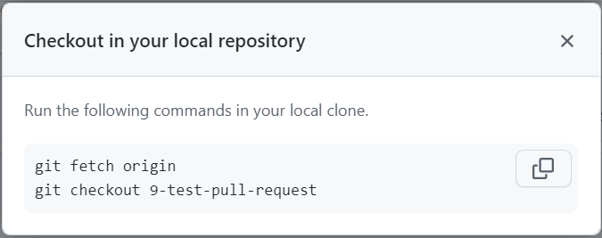

Nakon toga, potrebno je da se u lokalnom Git repozitorijumu prebacite na svježe kreirani ogranak korišćenjem prikazanih komandi.

U nastavku, član tima realizuje zadatak i u tom procesu predaje njegovo rješenje tako što koristi sljedeću sekvencu Git komandi.

```
git add <file(s)>
```

kojom se, nakon izmjena, dodaju željeni fajlovi u repozitorijum. Ovdje napominjemo da `<file(s)>` sadrži jedan ili više fajlova koje dodajemo u repozitorijum, pri čemu se navodi kompletna putanja do fajla (ne samo naziv). Ukoliko navedemo putanju do direktorijuma, svi fajlovi unutar direktorijuma će biti dodani. Možemo da dodamo sve fajlove unutar jedne `git add` naredbe ili da ih dodajemo jedan po jedan korišćenjem više uzastopnih naredbi. Ako želimo da dodamo sve fajlove, možemo da koristimo i kraću notaciju `git add .`.

Nakon dodavanja fajlova, iste treba predati, tj. komitovati, naredbom

```
git commit -m "Commit message"
```

`Commit message` treba da bude smislena poruka koja identifikuje zadatak (eksplicitnim navođenjem njegovog broja i naziva), nakon čega se obično navodi lista sa opisom elemenata koji su riješeni unutar datog zadatka. Jedan primjer takve poruke ilustrovan je na slici ispod.

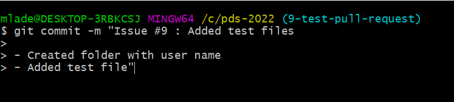

Konačno, rješenje predajemo na GitHub repozitorijum komandom `git push`. Potrebno je da naglasimo da se grana šalje na udaljeni repozitorijum navođenjem opcije `origin` u komandi, nakon čega slijedi naziv grane. U konkretnom slučaju, komanda ima sljedeći izgled.

```
git push origin 9-test-pull-request
```

Git alat će tražiti da unesete šifru (ako ste je definisali prilikom kreiranja privatnog ključa), a zatim, nakon ispravne autentifikacije, da ažurira granu na GitHub repozitorijumu.

Da bismo informisali ostale da je zadatak spreman za pregledanje, prebacujemo ga u sekciju *Review* i kreiramo *Pull Request*. Da bismo kreirali *Pull Request* za našu granu, u GitHub okruženju trebamo da izlistamo sve grane klikom na tabulator *Code*, a zatim da kliknemo na link *branches* kako je naznačeno na sljedećoj slici.

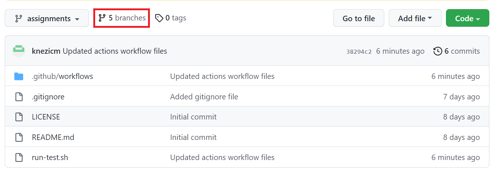

Iz liste grana, odaberemo našu granu i kliknemo na dugme *New pull request* kao što je dato na slici ispod.

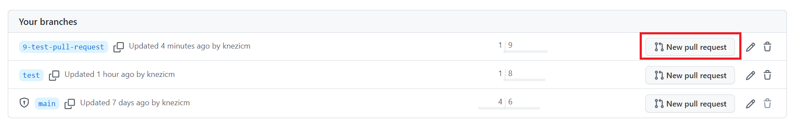

U novom prozoru (vidi sliku ispod) prvo definišemo odredišnu granu (*base*) u koju želimo da integrišemo našu granu (u datom slučaju je navedena grana *test*, ali u našem slučaju to će tipično da bude *assignments*). Takođe, obratite pažnju da izvorna grana (*compare*) bude grana za koju kreiramo *Pull Request*. Konačno, dodajemo naziv za *Pull Request* (treba da sadrži referencu ka zadatku na koji se odnosi) i komentare u kojima detaljnije opisujemo šta je urađeno u okviru njega. Definisana podešavanja potvrđujemo klikom na dugme *Create pull request*).

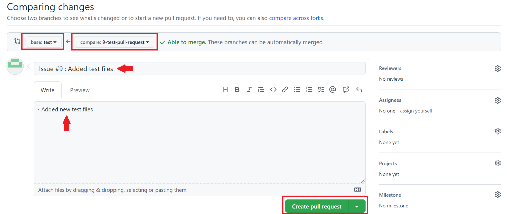

Nakon što smo kreirali *Pull Request*, treba da dodamo članove tima koji su zaduženi za njegovo pregledanje. Uz člana tima, obavezno dodajete i predmetnog nastavnika. To postižemo tako što u sekciji *Reviewers* (vidi sliku ispod) unutar kreiranog *Pull Request* unosa, prosto odaberemo željene članove tima iz liste.

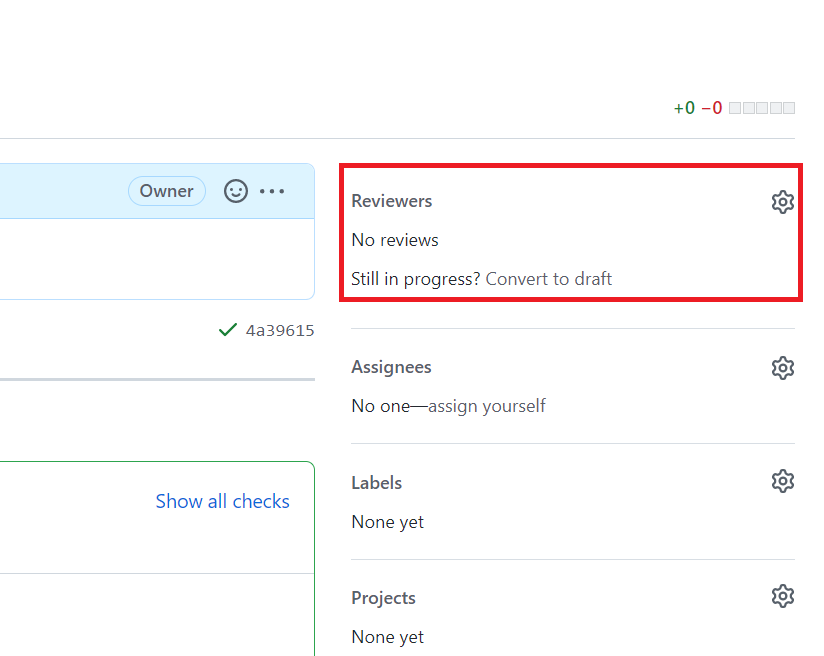

Nakon što predate rješenje, pokrenuće se automatizovana provjera, pri čemu se obično pokreće i skup unaprijed definisanih testova čiji je cilj da provjere da li je rješenje u skladu sa propisanim obrascima i da li zadovoljava definisanu funkcionalnost. Da biste vidjeli da li je rješenje zadovoljavajuće, trebate da odete na tabulator *Actions* unutar GitHub repozitorijuma i da provjerite da li je *Pull Request* označen zelenom bojom (kao na slici ispod). Ako jeste, onda je sve u redu, u suprotnom (ako nešto nije kako treba, biće označen crvenom bojom) potrebno je da kliknete na rješenje koje ste predali unutar *Actions* liste i da provjerite u logovima gdje je nastao problem.

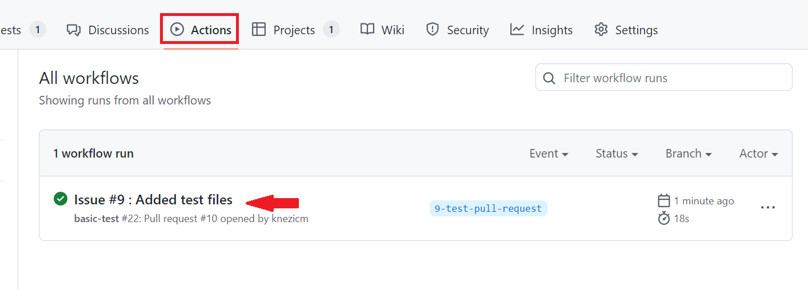

Provjera ispravnosti za *Pull Request* može da se obavi i tako što u listi *Pull requests* unutar repozitorijuma, otvorimo željeni *Pull Request*. Pri dnu prozora možemo da vidimo statusne informacije. Ako je sve u redu, vidjećemo poruku *All checks have passed*, u suprotnom dobićemo drugačiju poruku. Takođe, ovdje se klikom na dugme *Merge pull request* predano rješenje integriše sa odredišnom granom kao što je naznačeno na slici ispod.

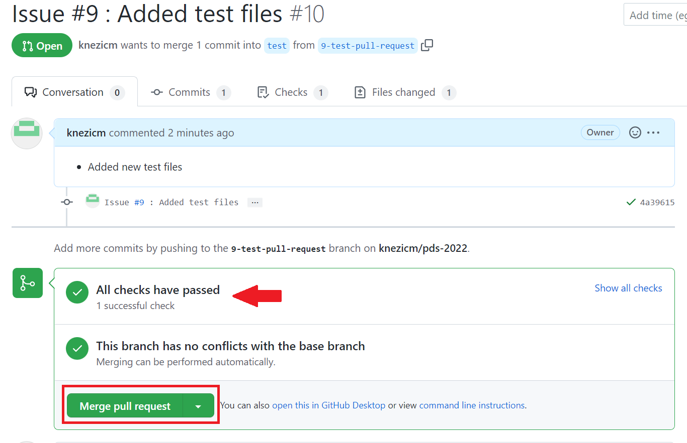

**Napomena:** Integraciju izmjena obavlja isključivo predmetni nastavnik (ukoliko nije drugačije definisano i dogovoreno). Studenti ne trebaju da na svoju ruku spajaju svoje rješenje sa glavnom granom.
